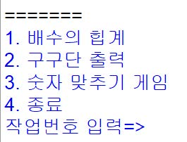

프로그램을 실행하면 그림과 같이 4개의 메뉴가 나타나고 작업번호를 입력하면 각각의 프로그램이 실행된다.



숫자 4를 입력하기 전까지는 프로그램이 종료되지 않고 4를 입력하면 프로그램이 종료된다.


숫자 1~4 이외의 숫자가 입력되면 다시 입력하라는 메시지를 출력한다.


숫자 1번을 입력시 시작값, 끝값, 배수를 입력받아 배수의 합계를 구한다.


숫자 2번을 입력시 구구단을 출력한다.


숫자 3번을 입력시 "숫자 맞추기 게임(숫자 야구 게임)"을 시작한다.

숫자 맞추기 게임은 list변수에 1~9 사이 3개의 숫자가 중복되지 않게 랜덤 생성을 하고 사용자가 숫자 3개를 입력하여 위치와 숫자를 모두 맞추기까지 몇번의 시도가 있었는지 출력하는 것이다.


## 소스

```python
import random

while(1):
    print("==============================================================")
    print("1. 배수의 합계")
    print("2. 구구단 출력")
    print("3. 숫자 맞추기 게임")
    print("4. 종료")
    num = int(input("작업번호 입력=>"))
    
    if (num == 1):
        start = int(input("시작 값을 입력하세요:"))
        end = int(input("끝 값을 입력하세요:"))
        drainage = int(input("배수를 입력하세요:"))
        sum = 0

        for i in range(start, end+1):
            if i % drainage == 0:
                sum += i

        print(str(start) + " 에서 " + str(end) + " 까지 " + str(drainage) + " 의 배수의 합은 " + str(sum) + " 입니다.")

    elif (num == 2):
        for i in range(1, 10):
            for j in range (2, 10):
                print(str(j) + "X" + str(i)+ "=" + str(i*j), end='\t')
            print()

    elif (num == 3):
        nums = [random.randint(1,9), random.randint(1,9), random.randint(1,9)]
        while (nums[0] == nums[1]):
            nums[1] = random.randint(1,9)
        while (nums[0] == nums[2] or nums[1] == nums[2]):
            nums[2] = random.randint(1,9)

        print("정답:", nums)
        try_count = 0
        strike_count = 0
    
        while(strike_count<3):
            strike_count = 0
            ball_count = 0
            innum = []

            for i in range(3):
                num = int(input(str(i+1)+"번째 수 입력=>"))
                innum.append(num)

            try_count += 1

            print(str(innum))

            for j in range(0, 3):
                for k in range(0, 3):
                    if(nums[j] == innum[k] and j == k):
                        strike_count += 1
                    elif(nums[j] == innum[k] and j != k):
                        ball_count += 1

            print(str(strike_count)+" 스트라이크 "+str(ball_count)+" 볼")
            
        print(str(try_count)+"번 만에 맞추었습니다.")
        
    elif (num == 4):
        print("프로그램을 종료합니다...")
        print("Bye Bye~")
        print("==============================================================")
        exit()

    else:
        print("숫자를 잘못 입력했습니다. 다시 입력하세요.")
```