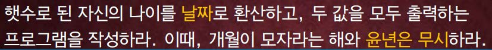

교재 64페이지 연습문제를 해결하는 프로그램을 작성하라.



이 문제에서는 자신의 나이가 아니라, 임의의 나이(혹은 몇 년(year))를 입력 받아서, 날짜로 환산하는 프로그램을 작성한다. 단, 1년은 365일로 계산한다.

## 입력
입력 데이터는 표준입력을 사용한다. 하나의 인치(inch)값을 나타내는 실수 값 x 가 주어진다. 단, x 는 10^3이하의 정수이다.

## 출력
출력은 표준출력을 사용한다. 첫째 줄에 입력을 받은 나이를 나타내는 정수값과 이 정수값이 날짜로 변환된 값을 모두 출력한다. 출력값은 다음과 같은 메시지가 같이 출력되도록 해야한다. An age of (입력 받은 값) years is (변환된 값) days. (단, 괄호는 출력하지 않아야 한다.)


## 입출력의 예

|입력|출력|
|---|---|
|2|An age of 2 years is 730 days.|
|21|An age of 21 years is 7665 days.|

## 소스

```c
#include <stdio.h>

int main() {
    int years, days;
    
    scanf("%d", &years);    
    
    days = 365*years;
    
    printf("An age of %d years is %d days.\n", years, days);
    
    return 0;
}
```