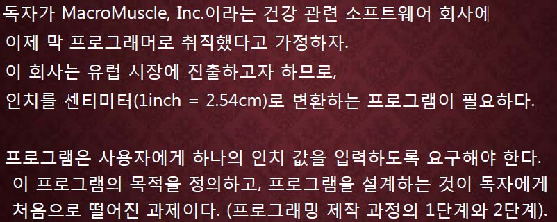

교재 32페이지 연습문제를 해결하는 프로그램을 작성하라.



## 입력
입력 데이터는 표준입력을 사용한다. 하나의 인치(inch)값을 나타내는 실수 값 x 가 주어진다. 단, x 는 10^3이하의 정수이다.

## 출력
출력은 표준출력을 사용한다. 첫째 줄에 센티미터로 변환된 인치값을 소숫점 2 째자리까지
출력한다.


## 입출력의 예

|입력|출력|
|---|---|
|3|7.62|
|123|312.42|

## 소스
```c
#include<stdio.h>

int main() {
    double inch, centimeter;
    
    scanf("%lf", &inch);
    
    centimeter = inch*2.54
    
    printf("%.2lf\n", centimeter);
    
    return 0;
}
```