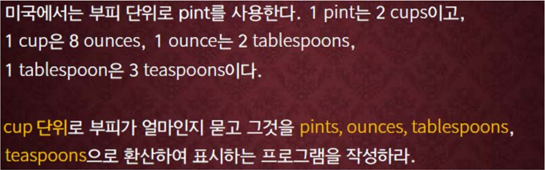

교재 118페이지 연습문제 8번을 해결하는 프로그램을 작성하라.



cup 단위의 부피를 하나의 실수로 입력 받아서, 이것을 pints, ounces, tablespoons, teaspoons로 환산하여 출력하는 프로그램을 작성하라.


## 입력
입력 데이터는 표준입력을 사용한다. 컵 단위의 부피를 나타내는 x 가 하나의 실수로 주어진다. 단, 0 ≤ x ≤ 1,000 이고, 유효숫자 자리수는 6 이하이다.

## 출력
출력은 표준출력을 사용한다. 첫째 줄에 입력된 cup 값에 해당되는 pints, ounces, tablespoons, teaspoons 값들을 출력한다. 출력 방식은 아래의 출력 예제와 똑 같이 한다.


## 입출력의 예

|입력|출력|
|---|---|
|1|1.000000 cups are equivalent to each of the following:<br>0.500000 pints<br>16.000000 tablespoons<br>48.000000 teaspoons|
|100.5|100.500000 cups are equivalent to each of the following:<br>50.250000 pints<br>1608.000000 tablespoons<br>4824.000000 teaspoons|

## 소스

```c
#include <stdio.h>

int main()
{
	double cups, pints, ounces, teaspoons, tablespoons;
	
	scanf("%lf", &cups);
	
	pints = cups / 2;
	ounces = cups * 8;
	tablespoons = ounces * 2;
	teaspoons = tablespoons * 3;
	
	printf("%lf cups are equivalent to each of the following:\n", cups);
	printf("%lf pints\n", pints);
	printf("%lf tablespoons\n", tablespoons);
	printf("%lf teaspoons\n", teaspoons);
	
	return 0;
}
```