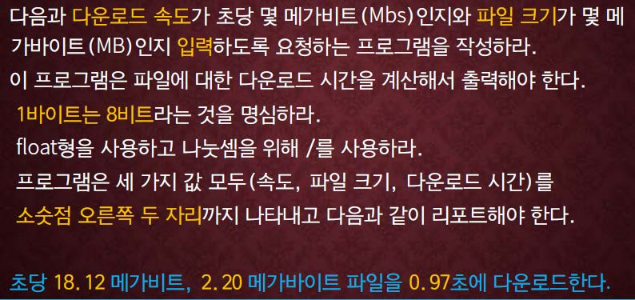

교재 166페이지 문제5번을 해결하는 프로그램을 작성하라.



## 입력
입력 데이터는 표준입력을 사용한다. 첫째줄에는 다운로드 속도를 나타내는 하나의 실수와 (단위는 Mbs), 파일의 크기를 나타내는 하나의 실수 (단위는 MB)가 주어진다.

## 출력
출력은 표준출력을 사용한다. 첫째 줄에 다운로드 시간을 소솟점이하 두자리까지 출력하고, "sec"문자열을 덧붙인다.


## 입출력의 예

|입력|출력|
|---|---|
|18.12 2.20|0.97sec|
|8.0 2.0|2.00sec|

## 소스

```c
#include <stdio.h>

int main()
{
	double mbs, mb, result;

	scanf("%lf %lf", &mbs, &mb);
	
	result = mb / mbs * 8;
	
	printf("%.2lfsec\n", result);

	return 0;
}
```