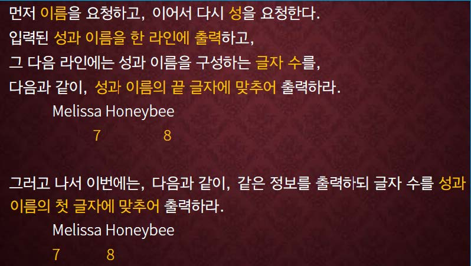

교재 167페이지 문제6번을 해결하는 프로그램을 작성하라.




## 입력
입력 데이터는 표준입력을 사용한다. 첫째줄에는 성과 이름을 나타내는 두개의 문자열이 빈칸을 하나 사이에 두고 주어진다. 단, 각 문자열의 길이는 30 을 넘지 않는다.


## 출력
출력은 표준출력을 사용한다. 위 문제에 주어진 형식으로 출력한다.


## 입출력의 예

|입력|출력|
|---|---|
|Hong Gildong|Hong Gildong<br>&nbsp;&nbsp;&nbsp;4&nbsp;&nbsp;&nbsp;&nbsp;&nbsp;&nbsp;&nbsp;7<br>Hong Gildong<br>4&nbsp;&nbsp;&nbsp;&nbsp;7|

## 소스

```c
#include <stdio.h>
#include <string.h>

int main()
{
	char fname[31], lname[31];
	
	scanf("%s %s", &fname, &lname);
	
	printf("%s %s\n", fname, lname);
	printf("%*d %*d\n", strlen(fname), strlen(fname), strlen(lname), strlen(lname));
	printf("%s %s\n", fname, lname);
	printf("%-*d %-*d\n", strlen(fname), strlen(fname), strlen(lname), strlen(lname));
	
	return 0;
}
```