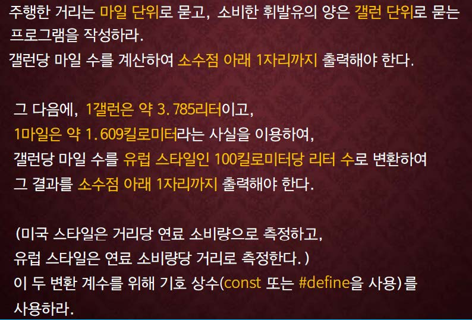

교재 167페이지 문제8번을 해결하는 프로그램을 작성하라.



## 입력
입력 데이터는 표준입력을 사용한다. 첫째줄에는 주행한 거리(마일단위)를 나타내는 하나의 실수값과 소비한 휘발유양 (갤런단위)을 나타내는 하나의 실수 값이 주어진다.


## 출력
출력은 표준출력을 사용한다. 갤런당 마일(소수점아래 1 자리까지)과 100 킬로미터당 리터(소수점아래 1 자리까지)를 하나의 줄에 아래의 예제와 같이 출력한다.


## 입출력의 예

|입력|출력|
|---|---|
|100.0 30.0|3.3 mpg or 70.6 liters / 100Km.|
|120.12 51.2|2.3 mpg or 100.3 liters / 100Km.|

## 소스

```c
#include <stdio.h>

int main()
{
	float miles, gallons, mpg, lp100;
	const float lpg = 3.785;
	const float kpm = 1.609;
	
	scanf("%f %f", &miles, &gallons);
	
	mpg = miles / gallons;
	lp100 = 100. / mpg  * lpg / kpm;

	printf("%.1f mpg or %.1f liters / 100Km.", mpg, lp100);
	
	return 0;
}
```