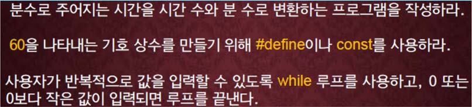

교재 218페이지 문제1번을 해결하는 프로그램을 작성하라.



예를 들어 85가 입력되면, 이 정수는 1시간 25분을 의미하므로, 1과 25를 출력한다.

## 입력
입력 데이터는 표준입력을 사용한다. 각 줄에는 분 단위의 하나의 시간이 정수 값으로 주어지고, 마지막 줄에는 0 혹은 음의 정수값이 주어진다. 

하나의 정수값은 1 이상 5,999 이하의 값이고, 입력데이터의 수(줄의 수)는 1 이상 20 이하이다.


## 출력
출력은 표준출력을 사용한다. 
하나의 분 단위의 시간을 시(hours)와 분(minutes)로 한 줄에 하나씩 아래의 예제와 같이 출력한다.

## 입출력의 예

|입력|출력|
|---|---|
|85<br>123<br>11<br>0|Time in minute(s):&nbsp;&nbsp;&nbsp;85 =&nbsp;&nbsp;1 hour(s) and 25 minute(s)<br>Time in minute(s):&nbsp;&nbsp;123 =&nbsp;&nbsp;2 hour(s) and&nbsp;&nbsp;3 minute(s)<br>Time in minute(s):&nbsp;&nbsp;&nbsp;11 =&nbsp;&nbsp;0 hour(s) and 11 minute(s)|
|4200<br>3655<br>5999<br>1<br>61<br>-1|Time in minute(s):&nbsp;4200 =&nbsp;70 hour(s) and&nbsp;&nbsp;0 minute(s)<br>Time in minute(s):&nbsp;3655 =&nbsp;60 hour(s) and 55 minute(s)<br>Time in minute(s):&nbsp;5999 =&nbsp;99 hour(s) and 59 minute(s)<br>Time in minute(s):&nbsp;&nbsp;&nbsp;&nbsp;1 =&nbsp;&nbsp;0 hour(s) and&nbsp;&nbsp;1 minute(s)<br>Time in minute(s):&nbsp;&nbsp;&nbsp;61 =&nbsp;&nbsp;1 hour(s) and&nbsp;&nbsp;1 minute(s)|

## 소스

```c
#include <stdio.h>

const int TIME = 60;

int main()
{
	int min;
	scanf("%d", &min);
	
	while (min > 0)
	{
		printf("Time in minute(s):%5d = %d hour(s) and %d minute(s)\n", min, min/TIME, min%TIME);
		scanf("%d", &min);
	};
	
	return 0;
}
```