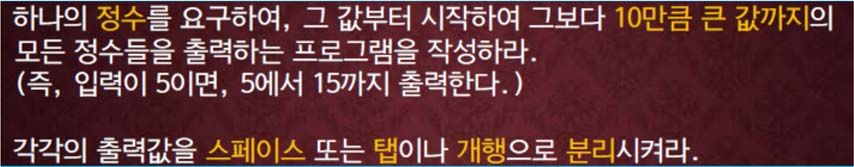

교재 218페이지 아래의 문제2번을 변형한 문제이다. 이를 해결하는 프로그램을 작성하라.



두개의 정수 n과 m을 입력으로 받는다. n보다 m만큼 작은 수부터 n보다 m만큼 큰 수까지의 합을 구하는 프로그램을 작성하라.

예를 들어, 10과 3을 입력으로 받았다면 10보다 3만큼 작은 수 7부터 10보다 3만큼 큰 수 13까지의 합 70을 출력한다.


## 입력
입력 데이터는 표준입력을 사용한다. 입력의 첫 줄에는 일한 날짜를 나타내는 하나의 정수 n이 주어진다. 단, 1 ≤ n ≤ 1,000,000 이다.
입력 데이터는 표준입력을 사용한다. 입력의 첫 줄에는 n과 m을 나타내는 두개의 정수가 주어진다. 
단, -1,000,000 ≤ n ≤ 1,000,000, 0 ≤ m ≤ 1,000,000이다.


## 출력

출력은 표준출력을 사용한다. 문제의 답을 첫째줄에 하나의 정수로 출력한다.

## 입출력의 예

|입력|출력|
|---|---|
|10 3|70|
|1000000 99999|199999000000|

## 소스
### While 사용
```c
#include <stdio.h>

int main()
{
	long long int n, m, a, b;
	long long int sum = 0;
	
	scanf("%lld %lld", &n, &m);

	a = n - m;
	b = n + m;
	
	while(a <= b)
    {
        sum += a;
        a++;
    }
    
	printf("%lld", sum);
	return 0;
}
```

### For 사용
```c
#include <stdio.h>

int main()
{
	long long int n, m, a, b;
	long long int sum = 0;
	
	scanf("%lld %lld", &n, &m);

	a = n - m;
	b = n + m;
	
	for (; a<=b; a++)
    {
        sum = sum + a;
    }
    
	printf("%lld", sum);
	return 0;
}
```


