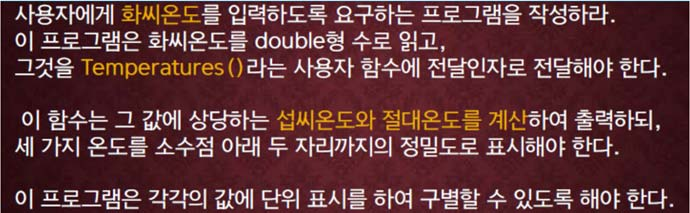

교재 220페이지 아래의 문제9번을 변형한 문제이다. 이를 해결하는 프로그램을 작성하라.




화씨 온도를 나타내는 실수 f를 입력으로 받는다. 이 온도를 섭씨 온도와 절대 온도로 변환하여 출력하는 프로그램을 작성하라.

예를 들어, 40.0을 입력으로 받았다면 섭씨 온도는 4.44, 절대 온도는 277.60을 출력한다.

## 입력
입력 데이터는 표준입력을 사용한다. 입력의 첫 줄에는 f 를 나타내는 하나의 실수가 주어진다. 
단, -459.67 ≤ f ≤ 100,000이다.


## 출력
출력은 표준출력을 사용한다. 화씨 온도와 섭씨 온도, 절대 온도를 소숫점이하 둘째자리까지를 아래의 예제와 같은 형식으로 출력한다.

## 입출력의 예

|입력|출력|
|---|---|
|100.0|Fahrenheit: 100.00 = Celsius: 37.78 = Kelvin: 310.94|
|0.0|Fahrenheit: 0.00 = Celsius: -17.78 = Kelvin: 255.38|
|200.78|Fahrenheit: 200.78 = Celsius: 93.77 = Kelvin: 366.93|

## 소스

```c
#include <stdio.h>

int main()
{
	double f, c, k;

	scanf("%lf", &f);

	c = 5.0 / 9.0 * (f - 32.0);

	k = c + 273.16;

	printf("Fahrenheit: %.2lf = Celsius: %.2lf = Kelvin: %.2lf", f, c, k);
	
	return 0;
}
```