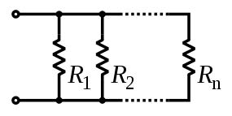
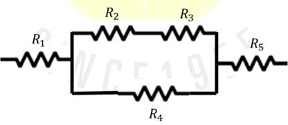

전자회로에서 저항 값의 계산은 다음의 두 가지의 경우로 나누어서 계산된다.

아래와 같이 저항들이 직렬로 연결되어 있을 경우의 저항 $R = R_1 + R_2 + ··· + R_n$ 이 되고,


저항들이 병렬로 연결이 되어 있을 경우에는 $\frac{1}{R} = \frac{1}{R_1} + \frac{1}{R_2} + ··· + \frac{1}{R_n}$이 된다.



다음과 같은 회로가 있을 때, 다섯 개의 저항 값을 읽고 전체의 저항 값을 구하는 프로그램을 작성하라.



## 입력
입력 데이터는 표준입력을 사용한다. 첫 줄에 다섯 개의 저항 값 R1, R2, R3, R4, R5가 정수로 주어진다.

단, 저항 값은 1 이상 1,000,000 이하의 정수이다.


## 출력
출력은 표준출력을 사용한다. 첫째 줄에 저항 값을 소수점 이하 다섯째 자리까지 출력한다. 

단, 소수점 이하 세 자리까지 맞으면 정답으로 인정한다.

## 입출력의 예

|입력|출력|
|---|---|
|1 1 1 2 2|4.00000|
|1 2 3 4 5|8.22222|

## 소스

```c
#include <stdio.h>

int main()
{
	long long int r1, r2, r3, r4, r5;
	double reseult;
	
	scanf("%lld %lld %lld %lld %lld", &r1, &r2, &r3, &r4, &r5);
	
	reseult = r1 + r5 + (double) ((r2+r3)*r4)/(r2+r3+r4)
	
	printf("%.5f", reseult);

	return 0;
}
```