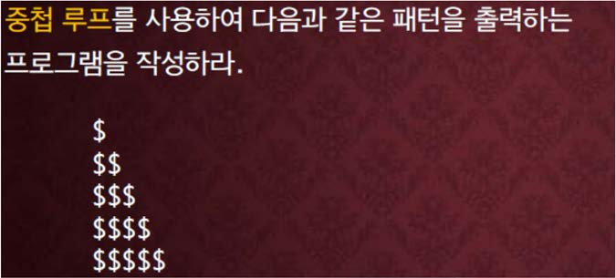

교재 280페이지 문제2번을 변형한 문제이다. 이를 해결하는 프로그램을 작성하라.



**하나의 정수를 입력으로 받아서 그 정수의 줄 수 만큼 위와 같은 모양으로 출력하는 프로그램을 작성하라.**

예를 들어, 5를 입력으로 받았다면 위의 책의 그림과 같이 출력한다.

## 입력

입력 데이터는 표준입력을 사용한다. 

입력의 첫 줄에는 출력될 줄의 수를 나타내는 하나의 정수가 주어진다. 

단, 정수는 1 이상 100 이하의 수이다.

## 출력

출력은 표준출력을 사용한다. 입력된 줄 수 만큼 위의 그림과 같이 삼각형 모양으로 출력한다.

## 입출력의 예

|입력|출력|
|---|---|
|3|&#36;<br>&#36;&#36;<br>&#36;&#36;&#36;|
|1|&#36;|
|6|&#36;<br>&#36;&#36;<br>&#36;&#36;&#36;<br>&#36;&#36;&#36;&#36;<br>&#36;&#36;&#36;&#36;&#36;<br>&#36;&#36;&#36;&#36;&#36;&#36;|

## 소스
### for 사용

```c
#include <stdio.h>

int main()
{
    int num;

    scanf("%d", &num);

    for(int i=0; i<num; i++)
    {
        for(int j=0; j<=i; j++)
        {
            printf("$");
        }
        
        printf("\n");
    }

    return 0;
}
```


### while 사용

```c
#include <stdio.h>

int main()
{
    int num, i, j;

    scanf("%d", &num);

    i = 0;

    while (i < num)
    {
        j = 0;

        while (j <= i)
        {
            printf("$");
            j++;
        }

        i++;

        printf("\n");
    }

    return 0;
}
```