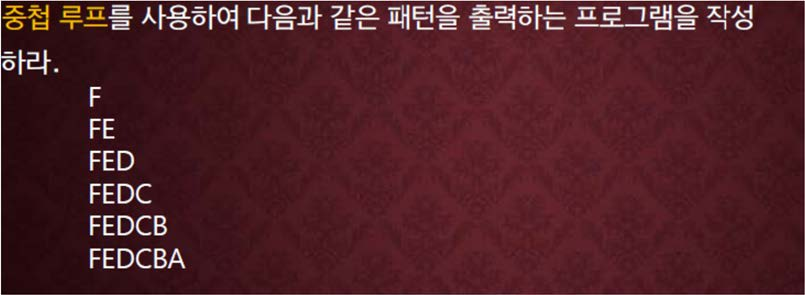

교재 280페이지 문제3번을 변형한 문제이다. 이를 해결하는 프로그램을 작성하라.



**하나의 정수를 입력으로 받아서 그 정수의 줄 수 만큼 위와 같이 역순의 알파벳을 출력하는 프로그램을 작성하라.**

예를 들어, 6를 입력으로 받았다면 위의 책의 그림과 같이 출력한다.

## 입력
입력 데이터는 표준입력을 사용한다. 입력의 첫 줄에는 출력될 줄의 수를 나타내는 하나의 정수가 주어진다. 

단, 정수는 1 이상 26 이하의 수이다.


## 출력
출력은 표준출력을 사용한다. 

입력된 줄 수 만큼 위의 그림과 같이 알파벳을 삼각형 모양으로 출력한다.

## 입출력의 예

|입력|출력|
|---|---|
|3|C<br>CB<br>CBA|
|1|A|
|6|F<br>FE<br>FED<br>FEDC<br>FEDCB<br>FEDCBA|

## 소스

### for 사용

```c
#include <stdio.h>

int main()
{
    int num;

    scanf("%d", &num);

    for(int i=0; i<num; i++)
    {
        for(int j=num; num-i<=j; j--)
        {
            printf("%c", 64+j);
        }

        printf("\n");
    }

    return 0;
}
```

### while 사용

```c
#include <stdio.h>

int main()
{
    int num, i, j;
    
    scanf("%d", &num);

    i = 0;

    while (i<num)
    {
        j = num;

        while (num-i<=j)
        {
            printf("%c", 64+j);
            j--;
        }

        printf("\n");

        i++;
    }

    return 0;
}
```