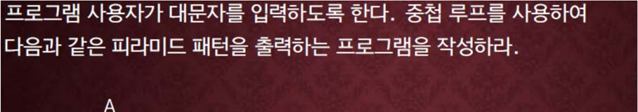
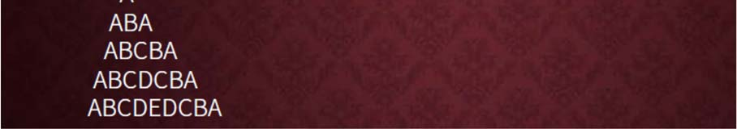

교재 281페이지 문제5번을 변형한 문제이다. 이를 해결하는 프로그램을 작성하라.




**하나의 문자를 입력으로 받아서 그 문자가 맨 아래 가운데 오게하는 피라미드 모양을 위와 같이 출력하는 프로그램을 작성하라. 단, 하나의 스페이스가 출력될 공간에는 ‘-‘기호를 출력하도록 한다.**

예를 들어, E를 입력으로 받았다면 아래의 예제 입출력 부분을 참고하라.

## 입력
입력 데이터는 표준입력을 사용한다. 입력의 첫 줄에는 하나의 문자가 주어진다. 단 A 에서 Z 사이의 대문자이다.

## 출력
출력은 표준출력을 사용한다. 입력된 문자가 가운데 오도록 위의 그림과 같이 알파벳을 피라미드 모양으로 출력하며, 스페이스가 출력될 공간에는 '\-'(마이너스 기호)를 출력한다.

## 입출력의 예

|입력|출력|
|---|---|
|C|\-\-A<br>\-ABA<br>ABCBA|
|A|A|
|E|\-\-\-\-A<br>\-\-\-ABA<br>\-\-ABCBA<br>\-ABCDCBA<br>ABCDEDCBA|
|Z|\-\-\-\-\-\-\-\-\-\-\-\-\-\-\-\-\-\-\-\-\-\-\-\-\-A<br>\-\-\-\-\-\-\-\-\-\-\-\-\-\-\-\-\-\-\-\-\-\-\-\-ABA<br>\-\-\-\-\-\-\-\-\-\-\-\-\-\-\-\-\-\-\-\-\-\-\-ABCBA<br>\-\-\-\-\-\-\-\-\-\-\-\-\-\-\-\-\-\-\-\-\-\-ABCDCBA<br>\-\-\-\-\-\-\-\-\-\-\-\-\-\-\-\-\-\-\-\-\-ABCDEDCBA<br>\-\-\-\-\-\-\-\-\-\-\-\-\-\-\-\-\-\-\-\-ABCDEFEDCBA<br>\-\-\-\-\-\-\-\-\-\-\-\-\-\-\-\-\-\-\-ABCDEFGFEDCBA<br>\-\-\-\-\-\-\-\-\-\-\-\-\-\-\-\-\-\-ABCDEFGHGFEDCBA<br>\-\-\-\-\-\-\-\-\-\-\-\-\-\-\-\-\-ABCDEFGHIHGFEDCBA<br>\-\-\-\-\-\-\-\-\-\-\-\-\-\-\-\-ABCDEFGHIJIHGFEDCBA<br>\-\-\-\-\-\-\-\-\-\-\-\-\-\-\-ABCDEFGHIJKJIHGFEDCBA<br>\-\-\-\-\-\-\-\-\-\-\-\-\-\-ABCDEFGHIJKLKJIHGFEDCBA<br>\-\-\-\-\-\-\-\-\-\-\-\-\-ABCDEFGHIJKLMLKJIHGFEDCBA<br>\-\-\-\-\-\-\-\-\-\-\-\-ABCDEFGHIJKLMNMLKJIHGFEDCBA<br>\-\-\-\-\-\-\-\-\-\-\-ABCDEFGHIJKLMNONMLKJIHGFEDCBA<br>\-\-\-\-\-\-\-\-\-\-ABCDEFGHIJKLMNOPONMLKJIHGFEDCBA<br>\-\-\-\-\-\-\-\-\-ABCDEFGHIJKLMNOPQPONMLKJIHGFEDCBA<br>\-\-\-\-\-\-\-\-ABCDEFGHIJKLMNOPQRQPONMLKJIHGFEDCBA<br>\-\-\-\-\-\-\-ABCDEFGHIJKLMNOPQRSRQPONMLKJIHGFEDCBA<br>\-\-\-\-\-\-ABCDEFGHIJKLMNOPQRSTSRQPONMLKJIHGFEDCBA<br>\-\-\-\-\-ABCDEFGHIJKLMNOPQRSTUTSRQPONMLKJIHGFEDCBA<br>\-\-\-\-ABCDEFGHIJKLMNOPQRSTUVUTSRQPONMLKJIHGFEDCBA<br>\-\-\-ABCDEFGHIJKLMNOPQRSTUVWVUTSRQPONMLKJIHGFEDCBA<br>\-\-ABCDEFGHIJKLMNOPQRSTUVWXWVUTSRQPONMLKJIHGFEDCBA<br>\-ABCDEFGHIJKLMNOPQRSTUVWXYXWVUTSRQPONMLKJIHGFEDCBA<br>ABCDEFGHIJKLMNOPQRSTUVWXYZYXWVUTSRQPONMLKJIHGFEDCBA|

## 소스

### for 사용

```c
#include <stdio.h>

int main()
{
    char input, i, j, k;

    scanf("%c", &input);

    for(i=65; i<=input; i++)
    {
        for (j=0; j<input-i; j++)
	    {
		    printf("-");
	    }

        for (k=65; k<i; k++)
        {
            printf("%c", k);
        }

        for (; k>=65; k--)
        {
            printf("%c", k);
        }
        
        printf("\n");
    }
    return 0;
}
```

```c
#include <stdio.h>

int main()
{
    char input, i, j, k;

    scanf("%c", &input);

    for(i='A'; i<=input; i++)
    {
        for (j=0; j<input-i; j++)
	    {
		    printf("-");
	    }

        for (k='A'; k<i; k++)
        {
            printf("%c", k);
        }

        for (; k>='A'; k--)
        {
            printf("%c", k);
        }
        
        printf("\n");
    }
    return 0;
}
```

### while 사용

```c
#include <stdio.h>

int main()
{
    char input, i, j, k;

    scanf("%c", &input);

    i = 65;

    while(i <= input)
    {
        j = 0;
        k = 65;

        while (j < input-i)
        {
            printf("-");
            j++;
        }

        while (k < i)
        {
            printf("%c", k);
            k++;
        }
        
        while (k >= 65)
        {
            printf("%c", k);
            k--;
        }
        
        printf("\n");

        i++;
    }
    return 0;
}
```

```c
#include <stdio.h>

int main()
{
    char input, i, j, k;

    scanf("%c", &input);

    i = 'A';

    while(i <= input)
    {
        j = 0;
        k = 'A';

        while (j < input-i)
        {
            printf("-");
            j++;
        }

        while (k < i)
        {
            printf("%c", k);
            k++;
        }
        
        while (k >= 'A')
        {
            printf("%c", k);
            k--;
        }
        
        printf("\n");

        i++;
    }
    return 0;
}
```