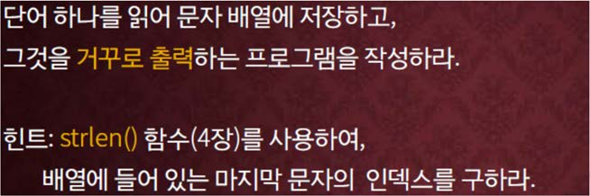

교재 281페이지 문제7번을 변형한 문제이다. 이를 해결하는 프로그램을 작성하라.



**하나의 문자열(단어)를 입력으로 받아서 그것을 거꾸로 출력하는 프로그램을 작성하라.**

## 입력
입력 데이터는 표준입력을 사용한다. 입력의 첫 줄에는 하나의 문자열이 주어진다. 단, 입력되는 문자열의 길이는 1 이상 100 이하이다.

## 출력
출력은 표준출력을 사용한다. 입력으로 받은 문자열을 거꾸로 출력한다.


## 입출력의 예

|입력|출력|
|---|---|
|Hello|olloH|
|Kyungsung|gnusgnuyK|

## 소스

```c
#include <stdio.h>
#include <string.h>

int main()
{
	char text[100];
	
	scanf("%s", text);

	for (int i = strlen(text) - 1; i >= 0; i--) printf("%c", text[i]);

    return 0;
}
```