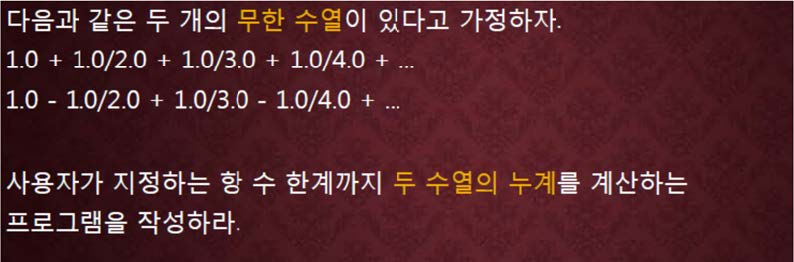

교재 282페이지 문제12번을 변형한 문제이다. 이를 해결하는 프로그램을 작성하라.




**문제에서 주어진 두 무한수열의 값을 구할 항의 수 n을 입력으로 받아서 두 무한수열의 값을 구하는 출력하는 프로그램을 작성하라.**


## 입력
입력 데이터는 표준입력을 사용한다. 입력의 첫 줄에는 항의 수를 나타내는 하나의 정수 n 이 주어진다. 단 1 ≤ n ≤ 10,000이다.

## 출력
출력은 표준출력을 사용한다. 두 무한수열의 값을 하나의 줄에 빈칸을 사이에 두고 소수점이하 5 자리까지 출력한다. (채점은 소수점 이하 3 자리까지 맞으면 정답으로 간주한다.)


## 입출력의 예

|입력|출력|
|---|---|
|4|2.08333 0.58333|
|10000|9.78761 0.69310|
|10|2.92897 0.64563|
|2|1.50000 0.50000|

## 소스

```c
#include <stdio.h>

int main(void)
{
    int n;
    double np = 1.0f;
    double a = 0.0f, b = 0.0f;

    scanf("%d", &n);

    if (n > 0) {
        for (long i = 1; i <= n; i++)
        {
            a += 1.0/i;
            b += 1.0/i * np;
            np = -np;
        }

        printf("%.5lf %.5lf", a, b);
        
    }
    
    return 0;
}
```