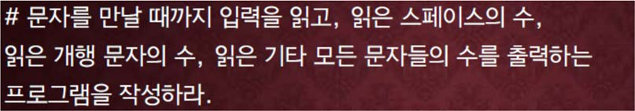

교재 344페이지 문제 1번이다. 이를 해결하는 프로그램을 작성하라.



## 입력
입력 데이터는 표준입력을 사용한다. 문자열이 여러 줄에 걸쳐서 입력된다. 

입력의 마지막 줄 첫번째 문자는 #이다.

## 출력
출력은 표준출력을 사용한다. 출력의 첫째 줄에 읽은 스페이스의 수, 읽은 개행(newline) 문자의 수, 위 둘을 제외한 읽은 문자의 수를 출력한다.


## 입출력의 예

|입력|출력|
|---|---|
|I can do it.<br>#|3 1 9|
|I wandered lonely as a cloud<br>That floats on high o'er vales and hills,<br>When all at once I saw a crowd,<br>A host, of golden daffodils;<br>Beside the lake, beneath the trees,<br>Fluttering and dancing in the breeze.<br>#|33 6 167|
|A B C D E F G H I J K L M N O<br>#|14 1 15|

## 소스

```c
#include <stdio.h>

int main(void)
{
    char ch;
    int space = 0, newline = 0, other = 0;

    while ((ch = getchar()) != '#')
	{
		if (ch == ' ') space++;
		else if (ch == '\n') newline++;
		else other++;
	}

    printf("%d %d %d\n", space, newline, other);

    return 0;
}
```