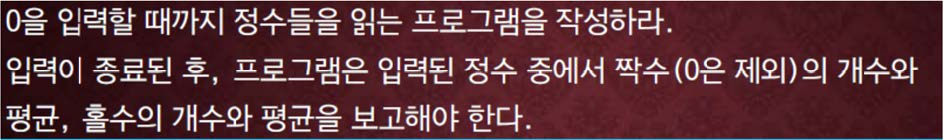

교재 344페이지 문제 3번이다. 이를 해결하는 프로그램을 작성하라.



## 입력
입력 데이터는 표준입력을 사용한다. 정수들이 하나의 빈칸 혹은 하나의 개행 문자를 사이에 두고 주어진다. 

데이터의 마지막은 0 이며, 입력되는 정수 값의 범위는 -1,000,000 부터 1,000,000 사이의 수이며, 정수의 수는 100,000 을 넘지 않는다.

## 출력
출력은 표준출력을 사용한다. 출력의 첫째 줄에 짝수의 개수와 그의 평균, 홀수의 개수와 그의 평균을 하나의 줄에 출력한다.

단, 평균 값은 소수점 이하 둘째 자리까지 출력한다. (마지막에 입력되는 0 은 계산에서 제외한다.)


## 입출력의 예

|입력|출력|
|---|---|
|3 5 7 2 4 6 0|3 4.00 3 5.00|
|2 4 6 22 44 66 88 10 122 144 0|10 50.80 0 0.00|

## 소스

```c
#include <stdio.h>

int main(void)
{
    int input;
    int odd_count = 0, even_count = 0;
    double odd_sum = 0.0, even_sum = 0.0, odd_average = 0.0, even_average = 0.0;

    while (scanf("%d", &input) == 1 && input != 0)
	{
		if (input % 2 == 0)
		{
			even_sum += input;
			even_count++;
		}
		else
		{
			odd_sum += input;
			odd_count++;
		}
	}

    if (odd_count != 0) odd_average = odd_sum / odd_count;
    if (even_count != 0) even_average = even_sum / even_count;

    printf("%d %.2lf %d %.2lf", even_count, even_average, odd_count, odd_average);

    return 0;
}
```