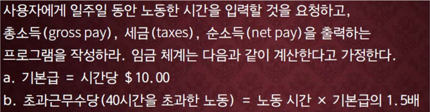

교재 345페이지 문제7번이다. 이를 해결하는 프로그램을 작성하라.




## 입력
입력 데이터는 표준입력을 사용한다. 노동시간이 하나의 정수로 주어진다.

## 출력
출력은 표준출력을 사용한다. 

출력의 첫째 줄에 총소득, 세금, 순소득을 소수점이하 두째자리까지 출력한다.


## 입출력의 예

|입력|출력|
|---|---|
|35|350.00 55.00 295.00|
|111|1465.00 328.75 1136.25|

## 소스

```c
#include <stdio.h>

#define BASE_PAY 10.0
#define OVER_TIME 40.0
#define OVER_TIME_RATE 1.5
#define TAX_RATE_1 0.15
#define TAX_RATE_2 0.20
#define TAX_RATE_3 0.25
#define TAX_LIMIT_1 300.0
#define TAX_LIMIT_2 450.0


int main(void)
{
    double hour, pay, tax;
    
    scanf("%lf", &hour);

    if (hour > OVER_TIME) {
        pay = OVER_TIME * BASE_PAY + (hour - OVER_TIME) * BASE_PAY * OVER_TIME_RATE;
    } else {
        pay =  hour * BASE_PAY;
    }

    if (pay > TAX_LIMIT_2) {
        tax = TAX_RATE_3 * (pay - TAX_LIMIT_2) + TAX_RATE_2 * (TAX_LIMIT_2 - TAX_LIMIT_1) + TAX_RATE_1 * TAX_LIMIT_1;
    } else if (pay > TAX_LIMIT_1) {
        tax = TAX_RATE_2 * (pay - TAX_LIMIT_1) + TAX_RATE_1 * TAX_LIMIT_1;
    } else {
        tax = TAX_RATE_1 * pay;
    }
    
    printf("%.2lf %.2lf %.2lf", pay, tax, pay-tax);
    

    return 0;
}
```