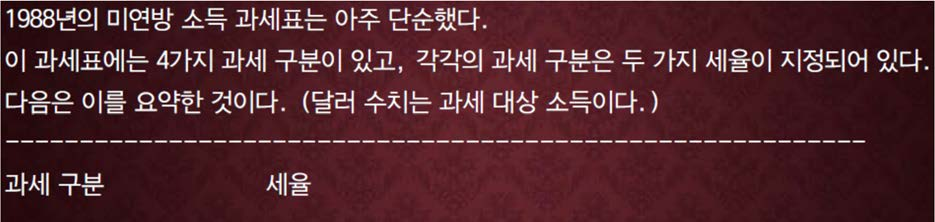
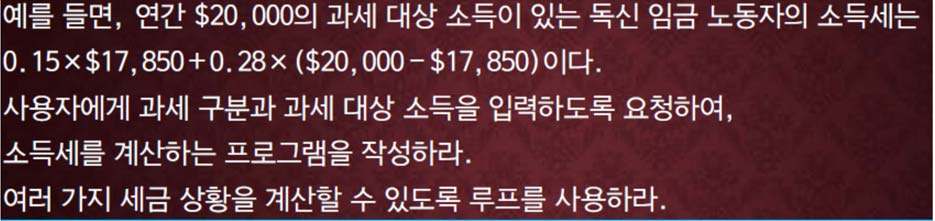

교재 345페이지 문제10번을 변형한 문제이다. 이를 해결하는 프로그램을 작성하라.





한 사람의 과세 구분과 소득을 입력으로 받아서 소득세를 계산하는 프로그램을 작성하라.

## 입력
입력 데이터는 표준입력을 사용한다. 

입력의 첫 줄에 과세 구분을 나타내는 하나의 정수와 소득을 나타내는 하나의 정수가 주어진다. 

단, 과세 구분은 나타내는 정수는 1 은 독신, 2 는 가장, 3 은 맞벌이(합산), 4 는 맞벌이(별산)을 나타낸다.

## 출력
출력은 표준출력을 사용한다. 출력의 첫째 줄에 소득세를 소수점이하 두째자리까지 출력한다.


## 입출력의 예

|입력|출력|
|---|---|
|1 20000.0|3279.50|
|2 30000.0|5293.00|
|3 40000.0|7332.50|
|4 10000.0|1500.00|

## 소스

```c
#include <stdio.h>

int main(void)
{
    int class;
    double money, tier, result;

    scanf("%d %lf", &class, &money);

    switch (class) {
    case 1:
        tier = 17850;
        break;
    
    case 2:
        tier = 23900;
        break;
    
    case 3:
        tier = 29750;
        break;

    case 4:
        tier = 14875;
        break;
    
    default:
        break;
    }

    if (money < tier) {
        result = money * 0.15;
    } else {
        result = tier * 0.15 + (money - tier) * 0.28;
    }

    printf("%.2lf", result);
    
    return 0;
}
```