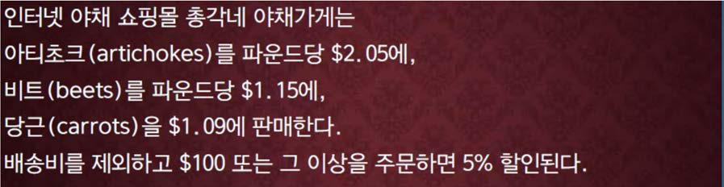
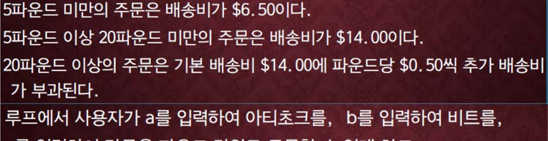
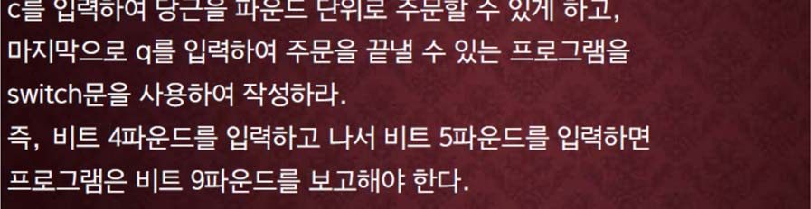
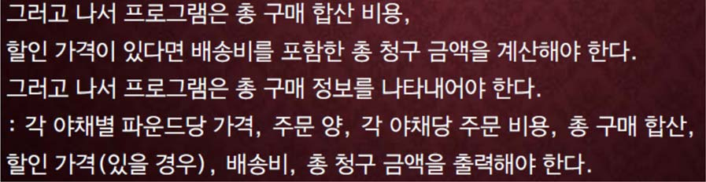

교재 345페이지 문제11번을 변형한 문제이다. 이를 해결하는 프로그램을 작성하라.






한 명의 구매자가 아티초크, 비트, 당근을 주문하면, 총 구매 금액을 계산하는 프로그램을 작성하라.

## 입력
입력 데이터는 표준입력을 사용한다. 

입력의 첫 줄에 구매하는 물품의 수를 나타내는 하나의 정수 n이 주어진다. 

둘째 줄부터 n 개의 줄에는 한 줄에 하나씩 구매 내용이 주어진다. 

구매 내용을 나타내는 하나의 줄에는 구입하려고 하는 물품의 종류를 나타내는 하나의 문자와 구입 양을
나타내는 무게가 정수로 주어진다. 

물품의 종류에서 문자 a 는 아티초크, 문자 b 는 비트, 문자 c 는 당근을 나타낸다.

## 출력
출력은 표준출력을 사용한다. 출력의 첫째 줄에 총 구매 금액을 소수점 이하 두째자리까지 출력한다.


## 입출력의 예

|입력|출력|
|---|---|
|3<br>a 1<br>b 1<br>c 1|10.79|
|1<br>c 100|167.55|
|5<br>a 10<br>b 10<br>c 10<br>a 10<br>c 10|113.30|
|5<br>c 5<br>b 1<br>a 5<br>b 1<br>c 1|33.09|

## 소스

```c
#include <stdio.h>
#include <ctype.h>

int main(void) {
    long long times, i = 0, count, weight, a = 0, b = 0, c = 0;
    char vegetable;
    double result;

    scanf("%lld", &times);

    while (i < times)
    {
        scanf("%c %lld", &vegetable, &count);
    
        switch (vegetable) {
            case 'a':
                a += count;
                break;

            case 'b':
                b += count;
                break;

            case 'c':
                c += count;
                break;
        }

        if (islower(vegetable)) i++;
    }

    result = a * 2.05 + b * 1.15 + c * 1.09;

    weight = a + b + c;

    if (result >= 100.0) result *= 0.95;

    if (weight < 5) result += 6.50;
    else if (weight >= 5 && weight < 20) result += 14.00;
    else result = result + 14.00 + weight * 0.50;

    printf("%.2lf", result);

    return 0;
}
```

```c
#include <stdio.h>

int main(void) {
    long long times, i = 0, count, weight, a = 0, b = 0, c = 0;
    char vegetable[2];
    double result;

    scanf("%lld", &times);

    for(int i=0; i<times; i++)
    {
        scanf("%s %lld", vegetable, &count);
    
        switch (vegetable[0]) {
            case 'a':
                a += count;
                break;

            case 'b':
                b += count;
                break;

            case 'c':
                c += count;
                break;
        }
    }

    result = a * 2.05 + b * 1.15 + c * 1.09;

    weight = a + b + c;

    if (result >= 100.0) result *= 0.95;

    if (weight < 5) result += 6.50;
    else if (weight >= 5 && weight < 20) result += 14.00;
    else result = result + 14.00 + weight * 0.50;

    printf("%.2lf", result);

    return 0;
}
```