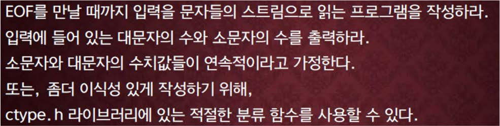

교재 389페이지 문제3번이다. 이를 해결하는 프로그램을 작성하라.



## 입력
입력 데이터는 표준입력을 사용한다. 문자열이 여러 줄에 걸쳐서 입력된다. 입력의 마지막에 특정한 입력이 주어지지 않는다.

## 출력
출력은 표준출력을 사용한다. 출력의 첫째 줄에 읽은 대문자의 수와 읽은 소문자의 수를 출력한다.


## 입출력의 예

|입력|출력|
|---|---|
|I can do it.|1 7|
|I wandered lonely as a cloud<br>That floats on high o'er vales and hills,<br>When all at once I saw a crowd,<br>A host, of golden daffodils;<br>Beside the lake, beneath the trees,<br>Fluttering and dancing in the breeze.|7 152|
|A B C D E F G H I J K L M N O|15 0|

## 소스

```c
#include <stdio.h>
#include <ctype.h>

int main(void)
{
	char ch;
	int count_upper = 0, count_lower = 0;
	
	while ((ch = getchar()) != EOF)
	{
		if (isupper(ch)) count_upper++;
		else if (islower(ch)) count_lower++;
	}
	
	printf("%d %d", count_upper, count_lower);
	
	return 0;
}
```