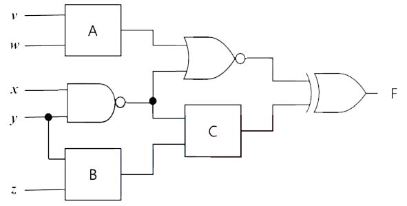

다음과 같은 논리회로가 있다. A부터 C까지의 3개의 게이트는 입력으로 주어진다.

각 게이트의 정보가 주어질 때, 회로의 출력 F가 참(True)이 되는 입력의 경우의 수를 출력하는 프로그램을 작성하라.



A부터 C까지의 3개의 게이트는 (1) OR (2) AND (3) NOR (4) NAND (5) XOR 중 하나이다.

예를 들어 A부터 C까지의 게이트가 모두 NOR 게이트이면, F의 출력은 v부터 z까지의 다섯개의 입력이 0,0,1,1,0 혹은 0,0,1,1,1인 두가지 경우에만 F가 출력이 참이 되므로 두가지 경우만 존재한다.

## 입력
입력은 표준입력을 사용한다. 첫 줄에 세개의 정수가 주어진다.

이 세개의 정수는 논리 게이트 A, B, C 의 정보를 나타낸다.

각 정수는 1 부터 5 까지의 정수인데, 1은 OR gate, 2는 AND gate, 3은 NOR gate, 4는 NAND gate, 5는 XOR gate 를 의미한다.

## 출력
출력은 표준출력을 사용한다. 첫째 줄에 출력 F 가 참이 되는 입력의 경우의 수를 하나의 정수로 출력한다.


## 입출력의 예

|입력|출력|
|---|---|
|3 3 3|2|
|3 4 5|8|
|1 2 3|4|
|1 1 1|30|

## 소스

```c
#include <stdio.h>
#include <stdbool.h>

int gate(int num, bool one, bool two);

int main(void)
{
	int A, B, C, count = 0;
	bool v, w, x, y, z, a, b, c, d, e;

	scanf("%d %d %d", &A, &B, &C);

	for(int i = 1; i < 5; i++) {
        v = i <= 2;
        w = i%2 == 0;

        a = gate(A, v, w);

        for(int j = 0; j < 2; j++) {
            x = j == 0;

            for(int k = 1; k < 5; k++) {
                y = k <= 2;
                z = k%2 == 0;

                b = gate(4, x, y);
                c = gate(B, y, z);
                d = gate(3, a, b);
                e = gate(C, b, c);

                if(gate(5, d, e)) count++;
            }
        }
    }

	printf("%d\n", count);

	return 0;
}

int gate(int num, bool one, bool two)
{
    switch (num) {
        case 1: return one||two;
        case 2: return one&&two;
        case 3: return !(one||two);
        case 4: return !(one&&two);
        case 5: return one^two;
    }
}
```