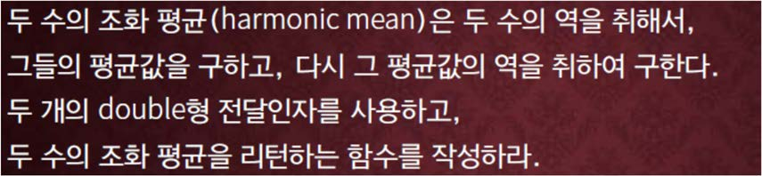

교재 447페이지 문제4번을 변형한 문제이다. 이를 해결하는 프로그램을 반드시 함수를 사용하여 작성하라.



즉, 두 개의 수 x, y의 조화 평균은 $({1 \over x} + {1 \over y}) / 2$ 의 역이다.

**<font color='red'>조화 평균을 구하는 함수는 두 개의 double형의 수를 전달인자로 받아서 조화 평균 값을 되돌려 주어야한다.</font>**

## 입력
입력 데이터는 표준입력을 사용한다. 입력의 각 줄에 두 개의 실수 값이 주어진다. 

숫자가 아닌 문자가 입력으로 들어오는 줄이 있으면 종료한다. 

단, 두 실수값은 0.0 보다 크고, 1,000,000 보다는 작다.

## 출력
출력은 표준출력을 사용한다.

각 줄에 주어지는 두 수의 조화평균을 함수를 이용하여 구하고, 소수점 이하 세 자리까지 출력한다.


## 입출력의 예

|입력|출력|
|---|---|
|1.0 2.0<br>1.0 100.0<br>q|1.333<br>1.980|
|123.0 456.0<br>12345.0 98765.0<br>Z|193.741<br>21946.790|

## 소스

```c
#include <stdio.h>

double harmonic(double i, double j);

int main(void)
{
	double i, j;

	while (scanf("%lf %lf", &i, &j) == 2)
		printf("%.3lf\n", harmonic(i, j));

	return 0;
}

double harmonic(double i, double j)
{
	return 1 / ((1 / i + 1 / j) / 2);
}
```