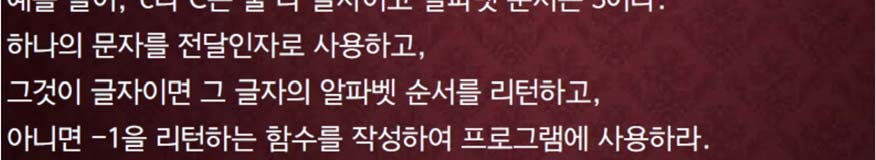

교재 448페이지 문제7번이다. 이를 해결하는 프로그램을 **반드시 함수를 사용하여 작성하라.**




**<font color='red'>함수는 하나의 문자를 전달인자로 받아서 그 문자의 알파벳 순서를 리턴하거나, 줄바꿈 문자 혹은 스페이스 문자인지에 대한 정보, 또는 그 외의 문자인지를 알려주어야 한다.</font>**

## 입력
입력 데이터는 표준입력을 사용한다. 문자열이 여러 줄에 걸쳐서 입력된다.

입력의 마지막에 특정한 입력이 주어지지 않는다.

## 출력
출력은 표준출력을 사용한다. 한 줄에 한 문자에 대한 정보를 출력한다.

예를 들어, 숫자 2 에 대해서는 '2 is not a letter.'라고 출력하고, 문자에 대해서는 그 문자와 그 문자의 순서를 아래의 예제와 같이 출력한다.

단, 줄바꿈 문자와 스페이스 문자에 대해서는 출력하지 않는다.


## 입출력의 예

|입력|출력|
|---|---|
|Hello, World!|H is a letter #8.<br>e is a letter #5.<br>l is a letter #12.<br>l is a letter #12.<br>o is a letter #15.<br>, is not a letter.<br>W is a letter #23.<br>o is a letter #15.<br>r is a letter #18.|
|if(true)<br>&nbsp;&nbsp;&nbsp;&nbsp;printf("TRUE!");|i is a letter #9.<br>f is a letter #6.<br>( is not a letter.<br>t is a letter #20.<br>r is a letter #18.<br>u is a letter #21.<br>e is a letter #5.<br>) is not a letter.<br>p is a letter #16.<br>r is a letter #18.<br>i is a letter #9.<br>n is a letter #14.<br>t is a letter #20.<br>f is a letter #6.<br>( is not a letter.<br>" is not a letter.<br>T is a letter #20.<br>R is a letter #18.<br>U is a letter #21.<br>E is a letter #5.<br>! is not a letter.<br>" is not a letter.<br>) is not a letter.<br>; is not a letter.|

## 소스

```c
#include <stdio.h>
#include <ctype.h>

int division(char ch);

int main(void)
{
	char ch;
	
	while ((ch = getchar()) != EOF)
	{
		if (division(ch) == -1) continue;
		else if (division(ch) == -2) printf("%c is not a letter.\n", ch);
		else printf("%c is a letter #%d.\n", ch, division(ch));
	}
	
	return 0;
}

int division(char ch)
{
	if (isalpha(ch)) {
		if (isupper(ch)) 
            return ch - 64;
		else 
            return ch - 96;
	} 
	else if (ch == ' ' || ch == '\n') return -1;
	else return -2;
}
```