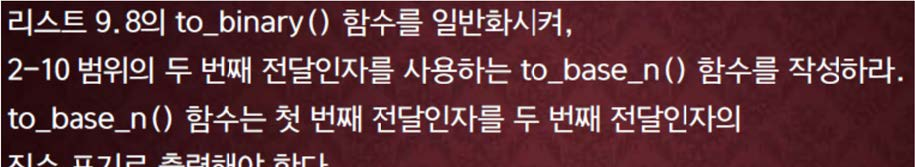

교재 448페이지 문제10번이다. 이를 해결하는 프로그램을 **반드시 함수를 사용하여 작성하라.**




**<font color='red'>함수는 교재의 함수와 같은 방법으로 작성하면 되는데, to_base_n()은 첫 번째 전달인수를 두 번째 전달인수의 진법으로 바꾸어 출력하도록 한다.</font>**

## 입력
입력 데이터는 표준입력을 사용한다. 입력의 첫 줄에 다른 진법으로 바꿀 십진수의 정수 $n$ 과
바꿔야할 진법 $b$가 주어진다. 단, $0 < n < 2^{31}-1, 2 \leq b \leq 10$ 이다.


## 출력
출력은 표준출력을 사용한다. 한 줄에 $b$ 진법으로 바꾼 수를 출력한다.


## 입출력의 예

|입력|출력|
|---|---|
|1000 2|1111101000|
|10000 5|310000|
|123456 10|123456|
|999999 9|1783660|

## 소스

```c
#include <stdio.h>

void to_base_n(unsigned long long num, int base);

int main(void) {
	unsigned long long num;
    int base;

	scanf("%llu %d", &num, &base);
    to_base_n(num, base);
    putchar('\n');

	return 0;
}

void to_base_n(unsigned long long num, int base)
{
	if (num == 0) return;

	to_base_n(num / base, base);
	printf("%d", num % base);

	return;
}
```