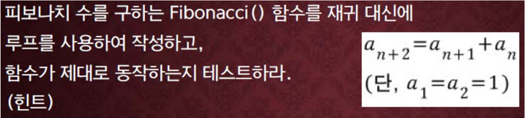
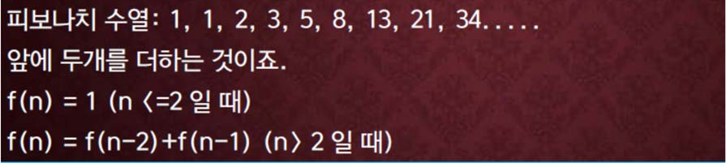

교재 448페이지 문제11번이다. 이를 해결하는 프로그램을 **반드시 함수를 사용하여 작성하라.**




피보나치 수는 $n = 0$ 부터 시작해서 $a_0 = 0, a_1 = 1, a_2 = 1, a_3 = 2, a_4 = 5 \cdots$ 순서로 만들어지는 수열이다.

**<font color='red'>함수 f(n)은 n을 전달인자로 받아서 n번째 피보나치 수를 리턴해야한다.</font>**


## 입력
입력 데이터는 표준입력을 사용한다. 입력의 한 줄에 하나의 정수 $n$이 주어진다. 

단, $0 \leq n \leq 93$ 이다. $n$이 음수가 되면 실행을 종료한다.

## 출력
출력은 표준출력을 사용한다. 
한 줄에 각 각 피보나치 수의 순서를 나타내는 $n$과 $n$번째 피보나치수를 아래의 예제와 같이 출력한다.


## 입출력의 예

|입력|출력|
|---|---|
|5<br>6<br>7<br>8<br>-1|#5: 5<br>#6: 8<br>#7: 13<br>#8: 21|
|0<br>10<br>20<br>30<br>92<br>93<br>-2|#0: 0<br>#10: 55<br>#20: 6765<br>#30: 832040<br>#92: 7540113804746346429<br>#93: 12200160415121876738|


## 소스

```c
#include <stdio.h>

unsigned long long Fibonacci(int n);

int main(void)
{
	int n;

    while(scanf("%d", &n) == 1 && n >= 0) printf("#%d: %llu\n", n, Fibonacci(n));

	return 0;
}

unsigned long long Fibonacci(int n)
{
    unsigned long long fn = 0, fn1 = 1, fn2;

	for (int i = 1; i <= n; i++)
	{
		fn2 = fn1;
		fn1 = fn;
		fn = fn1 + fn2;
	}

    return fn;
}
```