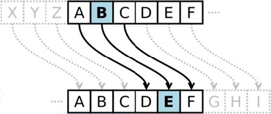

**카이사르 암호**(Caesar cipher) 또는 **시저 암호**는 암호학에서 다루는 간단한 치환암호의 일종이다.

암호화하고자 하는 내용을 알파벳 별로 일정한 거리만큼 밀어서 다른 알파벳으로 치환하는 방식이다.

예를 들어 3글자씩 밀어내는 카이사르 암호로 'COME TO ROME'을 암호화하면 'FRPH WR URPH'가 된다.

즉, 아래의 그림처럼 세 글자 뒤의 알파벳으로 치환하여 암호문을 만들어낸다. (아래의 그림 참조)



만약 네글자 뒤의 알파벳으로 치환한다면, 암호문은 ‘GSQI XS VSQI’가 된다.

하나의 암호문을 읽고, 원래의 문장(평문)을 출력하는 프로그램을 작성하라.

참고로, 보호해야 할 메시지를 **평문**(平文, plaintext)이라고 하며, 평문을 암호학적 방법으로 변환한 것을 **암호문**(暗號文, ciphertext)이라고 한다. 

평문을 암호문으로 변환하는 과정을 **암호화**(暗號化, encryption)라고 하며, 암호문을 다시 평문으로 변환하는 과정을 **복호화**(復號化, decryption) 라고 한다.

## 입력
입력 데이터는 표준입력을 사용한다. 

첫 줄에 암호문을 만들기 위해 사용된, 원래의 알파벳과 치환되는 알파벳의 거리를 나타내는, 하나의 정수 K 가 주어진다. (단, 0 ≤ K ≤ 26)

만약, K = 3 이라면, 원래의 알파벳 B 가 E 로 치환되어 암호문이 만들어졌음을 의미한다. 

그 다음 줄에는, 영어 알파벳 대문자로만 이루어진 암호문이 주어진다. 

암호문의 길이는 80 글자 이하이다. (BLANK 는 암호화 되지 않았음을 유의하라.)

## 출력
출력은 표준출력을 사용한다. 첫째 줄에 복호화한 평문을 출력한다.


## 입출력의 예

|입력|출력|
|---|---|
|3<br>FRPH WR URPH|COME TO ROME|
|4<br>GSQI XS VSQI|COME TO ROME|

## 소스

```c
#include <stdio.h>
#include <string.h>

int main(void) {
    int key;
    char text[81] = {0,};

    scanf("%d\n", &key);
    fgets(text, 81, stdin);

    for (int i = 0; i < strlen(text); i++) {
        if(text[i] >= 'A' && text[i] <= 'Z') {
            if (text[i] - key < 65 ) text[i] += 26;
            text[i] = text[i] - key;
        }
    }

    puts(text);

    return 0;
}
```