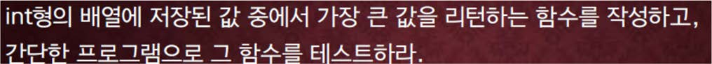

교재 515페이지 문제3번이다. 이를 해결하는 프로그램을 반드시 함수를 사용하여 작성하라.



main()함수에서 n개의 정수를 읽은 후, 함수를 호출하여 n개의 정수중에서 가장 큰 값을 리턴 받아 출력하는 프로그램을 작성한다.

## 입력
입력 데이터는 표준입력을 사용한다. 입력의 첫 줄에 n 개의 정수가 빈칸을 하나 사이에 두고 주어진다. 단, n 은 1 이상 100000 이하이며 정수 값은 -1000000 이상 1000000 이하의 값이다.

## 출력
출력은 표준출력을 사용한다. 한 줄에 가장 큰 값의 정수 하나를 출력한다.


## 입출력의 예

|입력|출력|
|---|---|
|1 10 2 9 8 3 7 6 4 5|10|
|11 99 88 22 77 66 99 11 44 77|99|

## 소스

```c
#include <stdio.h>

int compare(int input, int max);

int main(void) {
    int input, max = -1000000;

    while (scanf("%d", &input) != EOF) {
        max = compare(input, max);
    }

    printf("%d", max);

    return 0;
}

int compare(int input, int max) {
    if (input > max) max = input;
    return max;
}
```