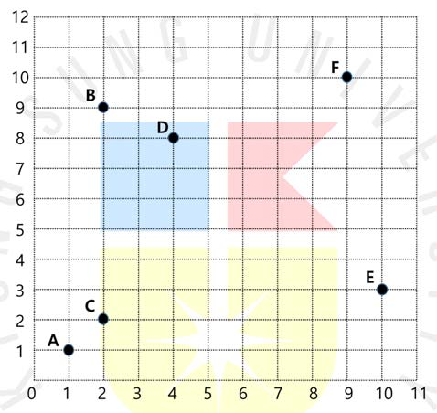

2차원 평면에 다음의 그림과 같이 6 개의 점이 있다고 하자. 각 점과 점들 사이의 거리는 두 점의 x 좌표값의 차이에 두 점의 y 좌표값의 차이를 더한 것으로 정의한다고 하자. 이 거리를 맨하탄 거리라고 부른다. 예를 들어 아래 그림의 점 B 와 점 D 사이의 맨하탄 거리는 3 이다. 왜냐하면, 점 B 의 좌표 (2,9)와 점 D 의 좌표 (4,8)에서 x 좌표값의 차이는 2, y 좌표값의 차이는 1 이므로 1 과 2 의 합은 3 이기 때문이다.



N개의 점의 좌표값이 주어질 때, 거리가 가장 먼 두 점의 거리를 구하는 프로그램을 작성하라.

## 입력
입력 데이터는 표준입력을 사용한다. 입력의 첫째 줄에 양의 정수 N (2 ≤ N ≤ 10,000)이 주어진다.

둘째 줄부터 N개의 줄에는 한 점의 좌표를 나타내는 두개의 정수가 하나의 빈칸을 사이에 두고 주어진다.

단, x 좌표값과 y 좌표값은 0 에서 1,000,000 사이의 값이다.

## 출력
출력은 표준출력을 사용한다. 가장 먼 두 점 사이의 거리를 출력한다.


## 입출력의 예

|입력|출력|
|---|---|
|6<br>1 1<br>2 9<br>2 2<br>4 8<br>10 3<br>9 10|17|
|4<br>1 1<br>1 9999<br>9999 9999<br>9999 1|19996|

## 소스

```c
#include <stdio.h>

struct Point {
    long long x, y;
} Array[10000];

int main(void) {
    int times, x, y;
    long long far = 0;
    
    scanf("%d", &times);

    for (int i = 0; i < times; i++) {
        scanf("%lld %lld", &Array[i].x, &Array[i].y);
    }

    for(int i = 0; i < times; i++) {
        for(int j = 0 ; j < times; j++) {
            far = abs(Array[j].x - Array[i].x) + abs(Array[j].y - Array[i].y) > far ? abs(Array[j].x - Array[i].x) + abs(Array[j].y - Array[i].y) : far;
        }
    }

    printf("%d", far);

    return 0;
}
```