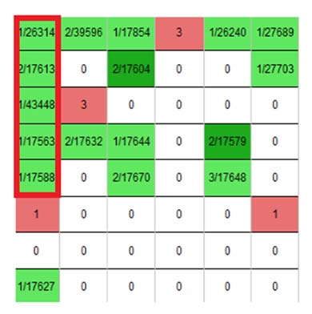

다음의 그림과 같은 스코어보드에서 초록색 사각형으로 연결된 가장 긴 띠 모양의 직사각형을 찾는 프로그램을 작성하라. 띠 모양의 직사각형이란, 한 변의 길이가 1인 직사각형을 의미한다. 

예를 들어, 다음과 스코어보드가 있을 경우에는 가로 1, 세로 5가 가장 큰 띠 모양의 직사각형이다. (하나의 작은 사각형은 세로 및 가로의 길이가 같다고 가정한다.)



스코어보드가 입력으로 주어질 때, 가장 긴 띠 모양의 직사각형을 출력하는 프로그램을 작성하라.

띠 모양은 가로로 길쭉한 모양 일수도 있고, 세로로 길쭉한 모양(위의 그림) 일수도 있음을 주의하라.

## 입력
입력 데이터는 표준입력을 사용한다. 입력의 첫째 줄에 양의 정수 M,N (3 ≤ M,N ≤ 500) 이 주어진다. 

둘째 줄부터 M 개의 줄에는 스코어보드의 정보가 주어지는데, 하나의 줄에는 􀜰개의 정수가 빈칸 없이 주어진다. 

단, 스코어보드의 초록색부분은 1, 흰색 부분은 0, 빨간색 부분은 2 로 주어진다.

## 출력
출력은 표준출력을 사용한다. 첫째 줄에 가장 긴 띠 모양 직사각형의 초록색 사각형의 수를 출력한다.


## 입출력의 예

|입력|출력|
|---|---|
|8 6<br>111211<br>101001<br>120000<br>111010<br>101010<br>200002<br>000000<br>100000|5|
|3 4<br>0000<br>0000<br>0000|0|
|4 5<br>11111<br>11211<br>11011<br>10201|5|

## 소스

```c
#include <stdio.h>

int compare(int a, int b) {
	return a > b ? a : b;
}

int size_x, size_y, res = 0;

int result_x[501][501] = {0};
int result_y[501][501] = {0};
char input[500][502] = {0};

int main(void) {
    scanf("%d %d", &size_x, &size_y);

    for (int i = 0; i < size_x; i++) {
        scanf("%s", &input[i]);
    }

    for (int i = 1; i <= size_x; i++) {
        for (int j = 1; j <= size_y; j++) {
            if (input[i-1][j-1] == '1') result_x[i][j] = 1 + compare(result_x[i][j-1], result_x[i][j]);
			res = res > result_x[i][j] ? res : result_x[i][j];
        }
    }

    for (int i = 1; i <= size_y; i++) {
        for (int j = 1; j <= size_x; j++) {
            if (input[j-1][i-1] == '1') result_y[j][i] = 1 + compare(result_y[j-1][i], result_y[j][i]);
			res = res > result_y[j][i] ? res : result_y[j][i];
        }
    }

    printf("%d\n", res);

    return 0;
}
```