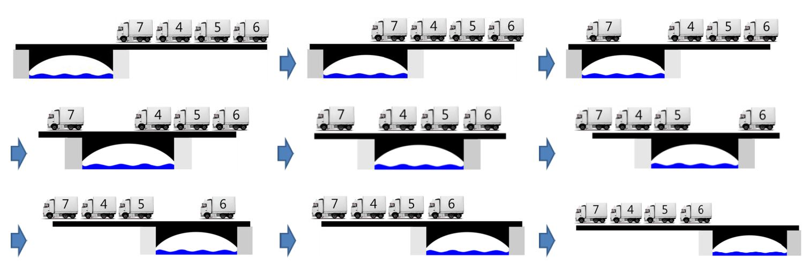

강을 가로지르는 하나의 차선으로 된 다리가 하나 있다. 이 다리를 𝑛 개의 트럭이 건너가려고 한다. 트럭의 순서는 바꿀 수 없으며, 트럭의 무게는 서로 같지 않을 수 있다. 다리 위에는 단지 𝑤 대의 트럭만 동시에 올라갈 수 있다. 다리의 길이는 𝑤 단위길이(unit distance)이며, 각 트럭들은 하나의 단위시간(unit time)에 하나의 단위길이만큼만 이동할 수 있다고 가정한다. 동시에 다리 위에 올라가 있는 트럭들의 무게의 합은 다리의 최대하중인 𝐿보다 작거나 같아야 한다. 참고로, 다리 위에 완전히 올라가지 못한 트럭의 무게는 다리 위의 트럭들의 무게의 합을 계산할 때 포함하지 않는다고 가정한다.

예를 들어, 다리의 길이 𝑤는 2, 다리의 최대하중 𝐿은 10, 다리를 건너려는 트럭이 트럭의 무게가 [7, 4, 5, 6]인 순서대로 다리를 오른쪽에서 왼쪽으로 건넌다고 하자. 이 경우 모든 트럭이 다리를 건너는 최단시간은 아래의 그림에서 보는 것과 같이 8이다.



다리의 길이와 다리의 최대하중, 그리고 다리를 건너려는 트럭들의 무게가 순서대로 주어졌을 때, 모든 트럭이 다리를 건너는 최단시간을 구하는 프로그램을 작성하라.

## 입력
입력 데이터는 표준입력을 사용한다. 입력은 두 줄로 이루어진다. 입력의 첫 번째 줄에는 세 개의 정수 𝑛 (1≤ 𝑛≤ 1,000), 𝑤 (1≤ 𝑤≤ 100) and 𝐿 (10≤ 𝐿≤ 1,000)이 주어지는데, 𝑛은 다리를 건너는 트럭의 수, 𝑤는 다리의 길이, 그리고 𝐿은 다리의 최대하중을 나타낸다. 입력의 두 번째 줄에는 𝑛개의 정수 𝑎1,𝑎2,⋯,𝑎𝑛 (1≤𝑎𝑖≤10)가 주어지는데, 𝑎𝑖는 𝑖번째 트럭의 무게를 나타낸다.

## 출력
출력은 표준출력을 사용한다. 모든 트럭들이 다리를 건너는 최단시간을 출력하라.


## 입출력의 예

|입력|출력|
|---|---|
|4 2 10<br>7 4 5 6|8|
|1 100 100<br>10|101|
|10 100 100<br>10 10 10 10 10 10 10 10 10 10|110|

## 소스

```c
#include <stdio.h>

struct Car {
    int weight, time, onbridge;
} car[1000];

int main(void) {
    int num, bridge_len, weight_limit;
    int bridge_count = 0, bridge_weight = 0;
    scanf("%d %d %d", &num, &bridge_len, &weight_limit);
    for (int i = 0; i < num; i++) {
        scanf("%d", &car[i].weight);
    }

    int i = 0, time = 0, end = 0;

    while (1) {
        for (int j = 0; j < num; j++) {
            if (car[j].onbridge) {
                car[j].time++;
                if (car[j].time >= bridge_len) {
                    if (j == num - 1) {
                        time++;
                        end = 1;
                        break;
                    }
                    bridge_count--;
                    bridge_weight = bridge_weight - car[j].weight;
                    car[j].onbridge = 0;
                }
            }
        }

        if (end) break;

        if (car[i].weight <= weight_limit - bridge_weight && bridge_count < bridge_len) {
            car[i].onbridge = 1;
            bridge_weight = bridge_weight + car[i].weight;
            bridge_count++;
            i++;
        }

        time++;
    }

    printf("%d", time);

    return 0;
}
```